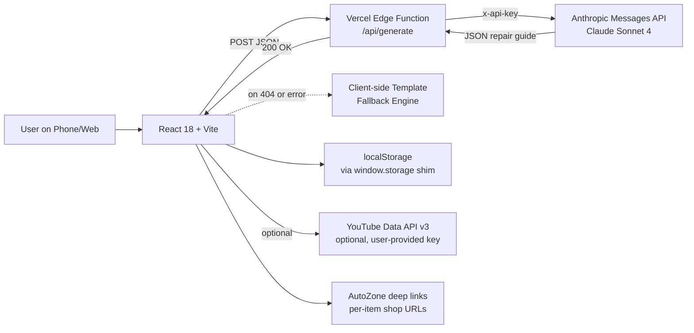

<div align="center">

# FixCost AI

**Know the fix. Know the cost.**

AI-powered car repair guidance with regional cost estimates, parts links, and YouTube tutorials. Free, instant, no account required. Bilingual EN / ES.

[**Live demo →**](https://fixcost.ai) &nbsp;·&nbsp; [Watch the 90s demo video](#demo) &nbsp;·&nbsp; [How it's built](#architecture) &nbsp;·&nbsp; [Roadmap](#roadmap)

[](https://react.dev)
[](https://vitejs.dev)
[](https://vercel.com)
[](LICENSE)

</div>

---

## The problem

When something goes wrong with your car, you're stuck between two bad options: pay a shop $100+ just for a *diagnosis*, or fall down a 4-hour rabbit hole of forum posts and YouTube videos that may or may not apply to your specific vehicle.

The information exists. It's just scattered, generic, and never quite matches your year/make/model/trim.

## The solution

Tell FixCost AI what you drive and what's wrong. In about 8 seconds, you get back:

- A **vehicle-specific diagnostic overview** that references your engine variant, known issues for your model year, and TSBs/recalls when relevant
- **DIY vs shop cost ranges** calibrated to your state's labor rate
- **Step-by-step instructions** with real torque specs and tool sizes
- **Per-item shop links** — every part and tool deep-links to AutoZone with your vehicle pre-filled
- **YouTube search terms** tuned to find the exact tutorial for your car
- A **difficulty rating** with reasoning ("Beginner — standard tools, accessible location")
- **Make-specific gotchas**: Ford modular spark plug breakage, BMW coding requirements, Honda VTEC solenoid screens, GM AFM lifter failures, Jeep death wobble, and more

All free. No signup. Mobile-first.

## Demo

> _90-second walkthrough lives at [fixcost.ai/demo](https://fixcost.ai) — see the full diagnostic flow on a 2013 Ford C-Max with a clunking suspension issue._

<!-- TODO: Embed demo gif or YouTube link once recorded -->

## Architecture



**Request lifecycle:** the React client calls `/api/generate` first. If the backend isn't deployed (404) or returns an error, it falls back to a client-side template engine that produces a useful, vehicle-specific guide from a static knowledge base. This means the app **never returns a broken state** — even with no AI available, you still get a guide.

The Edge Function is the only thing that holds the Anthropic API key. The client bundle has zero secrets.

## Tech stack & why

| Layer | Choice | Why |
|---|---|---|
| Frontend | React 18 + Vite | Fast HMR, tiny bundle, no over-engineering. No Next.js for a single-page app this size. |
| Hosting | Vercel | Edge Functions for API routes co-located with the frontend, free tier covers MVP traffic, auto-deploy from GitHub. |
| AI | Anthropic Claude Sonnet 4 | Better at producing structured JSON for technical content vs alternatives I tested. The system prompt asks for JSON only and validates the output before display. |
| Storage | `localStorage` via a custom `window.storage` shim | Original artifact uses the Claude artifact storage API; the shim makes the same calls work in any browser. Zero backend persistence — works fully offline once loaded. |
| Styling | Inline styles + a small CSS file | The app is one screen with limited reuse; a CSS framework would add 50KB for no benefit. |
| Build | Vite | 5-second cold builds, sub-second HMR. |
| Edge runtime | Vercel Edge | Lower cold-start latency than Node serverless. Sub-100ms TTFB for the AI call. |

## Decisions & tradeoffs

These are the calls that took some thought:

**Server-side AI proxy vs direct client calls.**  Direct client calls would mean shipping the API key in the bundle — fatal. The Edge Function adds one network hop (~30ms) but keeps the key safe and lets me add rate limiting, logging, and per-request validation server-side.

**Template fallback vs error state.**  Showing "Sorry, AI is unavailable" feels unprofessional. The template engine produces real, useful content (real torque specs, real tool sizes, vehicle-specific known issues from a manual database) when the AI fails or for environments without a configured key. Users still leave with a usable guide.

**No user accounts in v1.**  Auth adds friction. Garage and history live in `localStorage`, scoped per browser. Users sync via the "Export" feature. Auth comes when I add cross-device sync (see roadmap).

**Dropdown vs free-text vehicle inputs.**  Initial version had autocomplete text inputs — felt fast but failed on mobile. iOS dropdowns are universally familiar and one-tap. Trim dropdown is data-driven from a 70+ entry database and gracefully degrades to free text for rare models.

**Per-item shop links vs a single "Shop" button.**  Cards for each tool/part feel more useful and shoppable than one big button. AutoZone was picked over Amazon for the deep-link query format — it accepts vehicle prefix in the URL and shows compatible parts.

## Local development

Requires Node 18.17+ and npm.

```bash
git clone https://github.com/YOUR_USERNAME/fixcost-ai.git
cd fixcost-ai
npm install
cp .env.example .env.local   # add your ANTHROPIC_API_KEY
npm run dev
```

Open http://localhost:5173. Without an API key, the app still works using the template fallback.

For the backend to work in dev, you'll need the [Vercel CLI](https://vercel.com/docs/cli):

```bash
npm i -g vercel
vercel dev
```

This serves both the frontend and the Edge Function locally.

## Deployment

1. Push this repo to your GitHub
2. Import the repo at [vercel.com/new](https://vercel.com/new)
3. Add `ANTHROPIC_API_KEY` as an environment variable in the Vercel project settings
4. Click Deploy. Vercel auto-detects Vite, builds, and serves.

Custom domain setup is in Vercel → Settings → Domains. SSL is automatic and free.

## Project structure

```
fixcost-ai/
├── api/
│   └── generate.js          # Vercel Edge Function — proxies AI requests
├── src/
│   ├── App.jsx              # Main application (~150KB, single-file by design)
│   └── main.jsx             # React entry + window.storage polyfill
├── public/
│   ├── favicon.svg          # Branded wrench icon
│   ├── manifest.json        # PWA manifest
│   ├── robots.txt
│   └── sitemap.xml
├── docs/
│   ├── PRIVACY.md           # Privacy policy
│   ├── TERMS.md             # Terms of service
│   ├── BUILD_STORY.md       # Behind-the-scenes writeup
│   ├── DEMO_VIDEO_SCRIPT.md # Demo recording script
│   └── DISTRIBUTION.md      # Reddit/LinkedIn post drafts
├── index.html               # SPA entry with SEO meta tags
├── vercel.json              # Routing config
├── vite.config.js
└── package.json
```

## Roadmap

**Shipped:** v1.0 — bilingual AI guides, template fallback, garage, history, regional costs, dropdowns, per-item shop links, deployed.

**Next (sequenced by impact):**

- [ ] Supabase auth + cross-device garage sync — ~6 hours
- [ ] VIN lookup via NHTSA API for one-tap vehicle population — ~3 hours
- [ ] Photo upload + Claude Vision for visual symptom diagnosis — ~8 hours
- [ ] Sentry integration for error tracking — ~1 hour
- [ ] Maintenance reminder system based on saved vehicles + mileage
- [ ] iOS app via Capacitor + TestFlight submission
- [ ] Affiliate revenue tracking through AutoZone, RockAuto, O'Reilly

## Built by

**Kai Davis** — CS / AI student at UNC Charlotte (transferring from CPCC). Interested in ML engineering and applied AI roles.

- LinkedIn: [linkedin.com/in/YOUR_HANDLE](https://linkedin.com/in/YOUR_HANDLE)
- GitHub: [github.com/YOUR_USERNAME](https://github.com/YOUR_USERNAME)

If you're a hiring manager looking at this — happy to walk through any of the implementation decisions in detail. Email links in my LinkedIn.

## License

[MIT](LICENSE)

---

<sub>FixCost AI provides repair guidance for informational purposes only. Always verify torque specs and procedures against your vehicle's official service manual before performing repairs.</sub>
